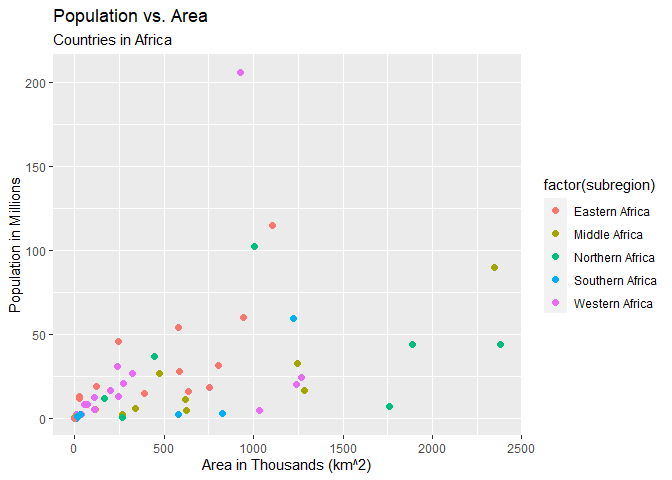

countrylayer-api
================
John Williams
9/27/2021

-   [Requirements](#requirements)
-   [API Interaction Functions](#api-interaction-functions)
    -   [`byAll`](#byall)
    -   [`byName`](#byname)
    -   [`byContinent`](#bycontinent)
    -   [`byRegion`](#byregion)
    -   [`byBloc`](#bybloc)
    -   [`byCurrency`](#bycurrency)
    -   [`byLanguage`](#bylanguage)
    -   [`countriesAPI`](#countriesapi)
-   [Data Exploration](#data-exploration)
    -   [Africa](#africa)
    -   [Languages](#languages)
    -   [English-Speaking Countries Using the United States
        Dollar](#english-speaking-countries-using-the-united-states-dollar)
    -   [Americas](#americas)
    -   [Regional Blocs](#regional-blocs)
-   [Wrap Up](#wrap-up)

## Requirements

The following R packages are required to use the functions to access the
`restcountries.com/v2` API:

    -`tidyverse`: A set of packages with tools that work in harmony to transform and visualize data
    -`httr`: Makes requesting data from API's easier by formatting GET requests with the proper headers and authentications
    -`jsonlite`: Converts the JSON from its native nested form to a flat form like a data frame so it's easier to work with

The following R packages are required to perform some of the exploratory
data analysis demonstrated in this document:

    -`knitr`: Provides a general-purpose tool for dynamic report generation

## API Interaction Functions

In this section, I offer several functions to access the
`restcountries.com/v2` API. The last function is a wrapper function to
make accessing multiple endpoints of the API with a single function
call.

### `byAll`

This function accesses the country data for the entire world.

``` r
byAll <- function(all){
  ###
  # This function accesses the country data for the entire world.
  ###
  
  # Get the data from the API
  data <- fromJSON("https://restcountries.com/v2/all")
  
  # Return the data from the request.
  return(data)
}
```

### `byName`

This function returns the data for all countries by name or partial
name.

Example: `byName("Aus")` returns data for both Australia and Austria.

``` r
byName <- function(name){
  ###
  # This function returns the data for all countries by name or partial name.
  ###
  
  #Substitute the empty space between words with "%20" to create a valid URL
  name <- sub(name, pattern = " ", replacement = "%20")
  
  # Set the base URL and combine with name for the full URL.
  base_URL <- "https://restcountries.com/v2/name/"
  URL <- paste0(base_URL, name)
  
  # Get the data from the API
  data <- fromJSON(URL)
  
  # If the request returns an error message, stop
  if(!is.null(data$message)) {
    message <- "No data for that country name or partial name was found."
    stop(message)
  }
  
  # Return the data from the request.
  return(data)
}
```

### `byContinent`

This function returns the data for all countries within a specified
continent.

    -Africa
    -Americas
    -Asia
    -Europe
    -Oceania

``` r
byContinent <- function(continent){
  ###
  # This function returns the data for all countries within a specified continent.
  ###
  
  #Substitute the empty space between words with "%20" to create a valid URL
  continent <- sub(continent, pattern = " ", replacement = "%20")
  
  # Set the base URL and combine with continent for the full URL.
  base_URL <- "https://restcountries.com/v2/continent/"
  URL <- paste0(base_URL, continent)
  data <- fromJSON(URL)
  
  # If the request returns an error message, stop
  if(!is.null(data$message)) {
    message <- paste0("No data for that continent was found. ",
                      "Please use one the the following options: ",
                      "Africa, Americas, Asia, Europe, or Oceania.")
    stop(message)
  }
  
  # Return the data from the request.
  return(data)
}
```

### `byRegion`

This function returns the data for all countries within a specified
region.

Example: `byRegion("Northern Europe")`

``` r
byRegion <- function(region){
  ###
  # This function returns the data for all countries within a specified region.
  ###
  
  #Substitute the empty space between words with "%20" to create a valid URL
  region <- sub(region, pattern = " ", replacement = "%20")
  
  # Set the base URL and combine with region for the full URL.
  base_URL <- "https://restcountries.com/v2/region/"
  URL <- paste0(base_URL, region)
  data <- fromJSON(URL)
  
  # If the request returns an error message, stop
  if(!is.null(data$message)) {
    message <- "No data for that region was found."
    stop(message)
  }
  
  # Return the data from the request.
  return(data)
}
```

### `byBloc`

This function returns the data for all countries within a specified
regional bloc.

    -EU (European Union)
    -EFTA (European Free Trade Association)
    -CARICOM (Caribbean Community)
    -PA (Pacific Alliance)
    -AU (African Union)
    -USAN (Union of South American Nations)
    -EEU (Eurasian Economic Union)
    -AL (Arab League)
    -ASEAN (Association of Southeast Asian Nations)
    -CAIS (Central American Integration System)
    -CEFTA (Central European Free Trade Agreement)
    -NAFTA (North American Free Trade Agreement)
    -SAARC (South Asian Association for Regional Cooperation)

``` r
byBloc <- function(bloc){
  ###
  # This function returns the data for all countries within a specified regional bloc.
  ###
  
  # If there is a blank space in the string bloc, create an acronym from the string bloc
  if (grepl(" ", bloc)){
    bloc <- abbreviate(bloc, minlength = 2)
  }
  
  # Mutate the bloc acronym to uppercase for easy logical comparisons
  bloc <- toupper(bloc)
  
  # If needed, change the bloc acronym into a form compatible with the API
  if (bloc == "CC"){
    bloc <- "CARICOM"
  }
  else if (bloc == "UOSAN"){
    bloc <- "USAN"
  }
  else if (bloc == "AOSAN"){
    bloc <- "ASEAN"
  }
  else if (bloc == "SAAFRC"){
    bloc <- "SAARC"
  }
  
  # Set the base URL and combine with region for the full URL.
  base_URL <- "https://restcountries.com/v2/regionalbloc/"
  URL <- paste0(base_URL, bloc)
  data <- fromJSON(URL)
  
  # If the request returns an error message, stop
  if(!is.null(data$message)) {
    message <- paste0("No data for that regional bloc was found. ",
                     "Please use one of the following options: ",
                     "AL, ASEAN, AU, CAIS, CARICOM, CEFTA, EEU, EFTA, ",
                     "EU, NAFTA, PA, SAARC, or USAN.")
    stop(message)
  }
  
  # Return the data from the request.
  return(data)
}
```

### `byCurrency`

This function returns the data for all countries with a specified
currency name (or partial name).

Example: `byCurrency("United States Dollar")` returns data for all
countries that have the United States Dollar as an official currency.

``` r
byCurrency <- function(currency){
  ###
  # This function returns the data for all countries with a specified currency name (or partial name).
  ###
  
  # Mutate currency to lowercase for easy logical comparisons
  currency <- tolower(currency)
  
  # Get ISO 4217 currency codes from API.
  c_codes <- fromJSON("https://openexchangerates.org/api/currencies.json")
  
  # Mutate currency codes to lowercase for easy logical comparisons
  c_codes_lower <- lapply(c_codes, tolower)
  
  # Create a vector of currency codes that are possible matches for the currency name
  c_names <- names(c_codes_lower)[grep(currency, c_codes_lower)]
  
  # If the vector of currency names has only one data value, return the data from the API
  if (length(c_names) == 1){
    base_URL <- "https://restcountries.com/v2/currency/"
    URL <- paste0(base_URL, c_names[1])
    data <- fromJSON(URL)
    return(data)
  }
  
  # If the vector of currency names contains no data value, stop
  else if (length(c_names) < 1){
    message <- "No currency matched that value.  Try again."
    stop(message)
  }
  
  # If the vector of currency names contains multiple data values, stop
  else{
    message <- paste0("Multiple currencies with that name/partial name were found. ",
                      "Did you mean one of these: ", 
                      stri_join_list(c_codes[grep(currency, c_codes_lower)], 
                                     collapse=", "))
    stop(message)
  }
}
```

### `byLanguage`

This function returns the data for all countries with a specified
language name (or partial name).

Example: `byLanguage("Arabic")` returns data for all countries that have
Arabic as an official language.

``` r
byLanguage <- function(language){
  ###
  # This function returns the data for all countries with a specified language name (or partial name).
  ###
  
  # Mutate language to lowercase for easy logical comparisons
  language <- tolower(language)
  
  # Get ISO 639-1 language codes from API.
  l_codes_URL <- paste0("https://pkgstore.datahub.io/core/language-codes/",
                       "language-codes_json/data/97607046542b532c395cf83",
                       "df5185246/language-codes_json.json")
  l_codes <- fromJSON(l_codes_URL)
  
  # Mutate language codes to lowercase for easy logical comparisons
  l_codes_lower <- lapply(l_codes, tolower)
  
  # Create a vector of language codes that are possible matches for the language name
  l_names <- l_codes_lower$alpha2[grep(language, l_codes_lower$English)]
  
  # If the vector of language names has only one data value, return the data from the API
  if (length(l_names) == 1){
    base_URL <- "https://restcountries.com/v2/lang/"
    URL <- paste0(base_URL, l_names)
    data <- fromJSON(URL)
    return(data)
  }
  
  # If the vector of language names contains no data value, stop
  else if (length(l_names) < 1){
    message <- "No language matched that value.  Try again."
    stop(message)
  }
  
  # If the vector of language names contains multiple data values, stop
  else{
    message <- paste0("Multiple languages with that name/partial name were found. ",
                      "Did you mean one of these: ", 
                      str_c(l_codes$English[grep(language, l_codes_lower$English)], 
                            collapse=", "))
    stop(message)
  }
}
```

### `countriesAPI`

This function is a wrapper for the other functions. It takes in the name
of the function to use as a character and any additional arguments for
that function.

``` r
countriesAPI <- function(fun, ...){
  ###
  # This function is a wrapper for the other functions. It takes in the name
  # of the function to use as a character and any additional arguments for that
  # function.
  ###
  
  # Find and call the appropriate function using conditional logic.
  if (fun == "byAll"){
    output <- byAll(...)
  }
  else if (fun == "byName"){
    output <- byName(...)
  }
  else if (fun == "byContinent"){
    output <- byContinent(...)
  }
  else if (fun == "byRegion"){
    output <- byRegion(...)
  }
  else if (fun == "byBloc"){
    output <- byBloc(...)
  }
  else if (fun == "byCurrency"){
    output <- byCurrency(...)
  }
  else if (fun == "byLanguage"){
    output <- byLanguage(...)
  }
  else {
    stop("Argument for func is not valid!")
  }
  
  # Return the output from the appropriate function.
  return(output)
}
```

## Data Exploration

### Africa

Let’s pull the data for all countries in Africa:

``` r
africa <- countriesAPI("byContinent", "Africa")
```

Let’s create a variable `pop_density` from the `population` and `area`
variables, and look at the numerical summary of population density by
`subregion`:

``` r
summary <- africa %>% 
           mutate(pop_density = population / area) %>%
           select(subregion, pop_density) %>%
           group_by(subregion) %>%
           filter(!is.na(pop_density)) %>%
           summarize("Minimum" = min(pop_density),
                     "First Quartile" = quantile(pop_density, 0.25),
                     "Median" = quantile(pop_density, 0.5),
                     "Mean" = mean(pop_density),
                     "Third Quartile" = quantile(pop_density, 0.75),
                     "Max" = max(pop_density),
                     "Std. Dev." = sd(pop_density))

kable(summary, caption = paste("Summary Statistics for Population Density by",
                               "Subregion in Africa"), digits = 2)
```

| subregion       | Minimum | First Quartile | Median |   Mean | Third Quartile |    Max | Std. Dev. |
|:----------------|--------:|---------------:|-------:|-------:|---------------:|-------:|----------:|
| Eastern Africa  |   24.43 |          43.32 |  77.93 | 174.82 |         210.72 | 620.46 |    191.42 |
| Middle Africa   |    7.75 |          13.63 |  22.21 |  46.08 |          47.06 | 227.35 |     65.92 |
| Northern Africa |    1.92 |          11.16 |  23.25 |  43.49 |          77.45 | 102.08 |     41.08 |
| Southern Africa |    0.02 |           3.32 |  26.31 |  32.18 |          62.25 |  70.57 |     33.51 |
| Western Africa  |    4.51 |          51.42 |  83.46 |  94.16 |         132.17 | 223.15 |     64.92 |

Summary Statistics for Population Density by Subregion in Africa

Now we can view this summary data as a boxplot:

``` r
data <- africa %>% 
        mutate(pop_density = population / area) %>%
        select(name, subregion, population, area, pop_density) %>%
        filter(!is.na(pop_density))

ggplot(data, aes(x = subregion, y = pop_density, fill = subregion)) + 
  geom_boxplot(alpha = 0.3) +
  theme(legend.position = "none") +
  labs(x = NULL,
       y = "Individuals per km^2",
       title ="Population Density",
       subtitle = "By Subregion in Africa")
```

<!-- -->

Finally, let’s take a look at the relationship between `population` and
`area`:

``` r
ggplot(data, aes(x = area/1000, y = population/1000000)) +
  geom_point(aes(color = factor(subregion)), size = 2) +
  labs(x = "Area in Thousands (km^2)",
  y = "Population in Millions",
  title ="Population vs. Area",
  subtitle = "Countries in Africa")
```

<!-- -->

It appears as the area of a country in Africa gets larger, the variance
in population grows. To reduce this non-constant variance, let’s
transform `population` and `area` by the natural logarithm and recreate
the plot:

``` r
lmod <- lm(log(population) ~ log(area), data = africa)

plot <- ggplot(data = africa, aes(log(area), log(population)))
plot + geom_point(aes(color = factor(subregion)), size = 2) +
       geom_smooth(method='lm') +
       labs(x = "log[Area (km^2)]",
            y = "log[Population]",
            title ="log[Population] vs. log[Area]",
            subtitle = "Countries in Africa")
```

<!-- -->

Except for one outlier in Southern Africa, there is a clear linear
relationship between `log(population)` and `log(area)` on the African
continent.

### Languages

Let’s take a look at the number of countries that have English, French,
Spanish, German, and Arabic, respectively, as an official language:

``` r
languages <- c("English", "French", "Spanish", "German", "Arabic")

english <- countriesAPI("byLanguage", "English")
french <- countriesAPI("byLanguage", "French")
spanish <- countriesAPI("byLanguage", "Spanish")
german <- countriesAPI("byLanguage", "German")
arabic <- countriesAPI("byLanguage", "Arabic")

numberOfCountries <- c(length(english$name),
                       length(french$name),
                       length(spanish$name), 
                       length(german$name),
                       length(arabic$name))

df <- data.frame(languages, numberOfCountries)

ggplot(data = df, aes(x = languages, y = numberOfCountries)) +
  geom_col(aes(fill = as.factor(languages))) +
  theme(legend.position = "none") +
  labs(x = "Language",
       y = "Count",
       title ="Number of Countries by Official Language")
```

<!-- -->

### English-Speaking Countries Using the United States Dollar

Let’s pull data for all countries that speak English and all countries
that use the United States Dollar:

``` r
dollar <- countriesAPI("byCurrency", "United States Dollar")
english <- countriesAPI("byLanguage", "English")
countries <- countriesAPI("byAll")

dollar <- dollar %>% mutate(english = "Yes") %>% select(name, english)
english <- english %>% mutate(USD = "Yes") %>% select(name, USD)
countries <- countries %>% select(name)
data <- full_join(dollar, english, by="name", type = "full") %>%
        # Substitute character string "No" for any NULL values
        mutate_if(is.character, coalesce, "No")
data <- full_join(data, countries, by = "name", type = "full") %>%
        # Substitute character string "No" for any NULL values
        mutate_if(is.character, coalesce, "No")

table(data$english, data$USD, dnn = c("US DOllar?", "English?"))
```

    ##           English?
    ## US DOllar?  No Yes
    ##        No  154  79
    ##        Yes   5  12

From the data, we see 12 countries have both English as an official
language and the Untied States Dollar as an official currency. Let’s
filter these countries from the data and print them:

``` r
english_dollar <- data %>%
                  filter(english == "Yes", USD == "Yes")

kable(english_dollar$name, col.names = "Countries:  English and US Dollar")
```

| Countries: English and US Dollar |
|:---------------------------------|
| American Samoa                   |
| British Indian Ocean Territory   |
| Virgin Islands (British)         |
| Virgin Islands (U.S.)            |
| Guam                             |
| Marshall Islands                 |
| Micronesia (Federated States of) |
| Northern Mariana Islands         |
| Palau                            |
| Puerto Rico                      |
| Turks and Caicos Islands         |
| United States of America         |

### Americas

Let’s gather all the data on countries in the Americas, create a new
variable `numBorders` which the number of countries that share a land
border of a country, and create a table with the count of countries that
have a certain number of land borders.

``` r
americas <- countriesAPI("byContinent", "Americas")

americas <- americas %>% 
            select(name, capital, region, subregion, population, demonym, area, 
                   gini, timezones, borders, currencies, languages, 
                   regionalBlocs, independent) %>%
            mutate(numBorders = as.numeric(lapply(americas$borders, length)))

americas %>% group_by(numBorders) %>%
             tally() %>%
             arrange(numBorders) %>%
             kable(col.names = c("Number of Countries Bordered", "Count"))
```

| Number of Countries Bordered | Count |
|-----------------------------:|------:|
|                            0 |    30 |
|                            1 |     4 |
|                            2 |    10 |
|                            3 |     6 |
|                            4 |     2 |
|                            5 |     4 |
|                           11 |     1 |

``` r
borders11 <- subset(americas, numBorders == 11, select = name)
```

Unsurprisingly, the largest country by area in the Americas, Brazil,
also has the most neighboring countries, a total of 11. And we’ve
learned that 30 countries in the Americas have no land border with other
countries. I’d make a guess that most of these countries that have no
land border with another country are in the Caribbean. Let’s investigate
this further:

``` r
americas %>% filter(numBorders == 0) %>%
             select(name, subregion) %>%
             kable(col.names = c("Name", "Subregion"), 
                   caption = "Counrties in the Americas with No Land Border")
```

| Name                                         | Subregion        |
|:---------------------------------------------|:-----------------|
| Anguilla                                     | Caribbean        |
| Antigua and Barbuda                          | Caribbean        |
| Aruba                                        | Caribbean        |
| Bahamas                                      | Caribbean        |
| Barbados                                     | Caribbean        |
| Bermuda                                      | Northern America |
| Bonaire, Sint Eustatius and Saba             | Caribbean        |
| United States Minor Outlying Islands         | Northern America |
| Virgin Islands (British)                     | Caribbean        |
| Virgin Islands (U.S.)                        | Caribbean        |
| Cayman Islands                               | Caribbean        |
| Cuba                                         | Caribbean        |
| Curaçao                                      | Caribbean        |
| Dominica                                     | Caribbean        |
| Falkland Islands (Malvinas)                  | South America    |
| Greenland                                    | Northern America |
| Grenada                                      | Caribbean        |
| Guadeloupe                                   | Caribbean        |
| Jamaica                                      | Caribbean        |
| Martinique                                   | Caribbean        |
| Montserrat                                   | Caribbean        |
| Puerto Rico                                  | Caribbean        |
| Saint Barthélemy                             | Caribbean        |
| Saint Kitts and Nevis                        | Caribbean        |
| Saint Lucia                                  | Caribbean        |
| Saint Pierre and Miquelon                    | Northern America |
| Saint Vincent and the Grenadines             | Caribbean        |
| South Georgia and the South Sandwich Islands | South America    |
| Trinidad and Tobago                          | Caribbean        |
| Turks and Caicos Islands                     | Caribbean        |

Counrties in the Americas with No Land Border

Our assumption is correct. The vast majority of countries with no land
border with another country are situated in the beautiful Caribbean Sea.

### Regional Blocs

Let’s get data for all countries and visually compare is there is a
benefit to wealth equality among the population if a country is a member
of a regional bloc. We’ll use the Gini coefficient, a popular measure
intended to represent the income inequality or the wealth inequality
within a nation. A Gini coefficient of zero expresses perfect income
equality; a Gini coefficient of one (100%) expresses maximal income
inequality.

``` r
# Get data for all countries.
tradeBloc <- countriesAPI("byAll")

# Create an indicator variable if a country is part of a regional bloc.
is.Bloc <- function(Bloc){
  isBloc <- lapply(Bloc, is.null)
  isBloc <- unlist(isBloc)
  return(ifelse(isBloc, "NO", "YES"))
}

# Tidy the data.
tradeBloc1 <- tradeBloc %>% 
              mutate(isBloc = is.Bloc(regionalBlocs)) %>%
              select(name, gini, isBloc) %>%
              filter(gini > 10)

# Create box plot.
ggplot(tradeBloc1, aes(isBloc, gini)) + 
  geom_boxplot(color = "black", fill = "#56B4E9") +
  geom_jitter() +
  labs(x = NULL,
       y = "Gini Coefficient",
       title ="Box Plot of Gini Coefficient",
       subtitle = "Is the country a member of a regional bloc?")
```

<!-- -->

From a visual inspection of the box plot above, we shouldn’t make any
conclusions about the difference in mean Gini coefficient between
groups. But there is visual evidence that countries within a regional
bloc have a greater variability in Gini coefficient than countries that
have no membership in a regional bloc.

Let’s dig deeper and look at the spread of Gini coefficients among
selected regional blocs:

``` r
# Helper function to unnest data frame within data frames.Sourced from:
# https://stackoverflow.com/questions/30896605/dataframe-within-dataframe
unnest_dataframes <- function(x) {
  y <- do.call(data.frame, x)
  if("data.frame" %in% sapply(y, class)) unnest_dataframes(y)
  y
}

# Helper function to return a vector from a list object by element position
delist <- function(list, ordinal){
  vector <- rep(NULL, length(list))
  for (i in 1:length(list)){
    if (!is.null(list[[i]][ordinal])){
      vector[i] <- list[[i]][ordinal]
    }
    else {
      #do nothing
    }
  }
  return(vector)
}

# Tidy the data
tradeBloc2 <- tradeBloc %>% 
              mutate(Bloc = delist(regionalBlocs, ordinal = 1)) %>%
              mutate(Bloc1 = delist(Bloc, ordinal = 1)) %>%
              mutate(Bloc2 = delist(Bloc, ordinal = 2)) %>%
              select(name, gini, Bloc1, Bloc2) %>%
              filter(gini > 10)

for (i in 1:length(tradeBloc2$Bloc2)){
  if (!is.na(tradeBloc2$Bloc2[i])){
    tradeBloc2 <- tradeBloc2 %>% 
                  add_row(name = tradeBloc2$name[i], 
                          gini = tradeBloc2$gini[i],
                          Bloc1 = tradeBloc2$Bloc2[i],
                          Bloc2 = NULL)
  }
}

tradeBloc2 <- filter(tradeBloc2, Bloc1 %in% c("AL", "AU", "EU", 
                                              "NAFTA", "SAARC", "USAN"))

# Create dot plot
ggplot(tradeBloc2, aes(x = factor(Bloc1), y = gini, fill = factor(Bloc1))) + 
  geom_dotplot(binaxis = "y", stackdir = "center") +
  stat_summary(fun.y = mean, geom = "point", shape = 18, size = 5, 
               color = "black") +
  theme(legend.position = "none") +
  labs(x = NULL,
       y = "Gini Coefficient",
       title ="Gini Coefficient by Selected Regional Bloc")
```

<!-- -->

``` r
# Get data for all countries.
countries <- countriesAPI("byAll")
countries <- filter(countries, gini > 10, region %in% c("Europe", "Asia", "Africa"))

h <- ggplot(countries, aes(gini))
h +  geom_histogram()
```

<!-- -->

``` r
ggplot(countries, aes(x = gini, fill = region)) + # Draw overlaying histogram
  geom_histogram(position = "identity", alpha = 0.4, bins = 20)
```

<!-- -->

``` r
countries <- filter(countries, gini > 10, region %in% "Europe")

ggplot(countries, aes(subregion, gini)) + 
  geom_boxplot()
```

<!-- -->

## Wrap Up

TEST
